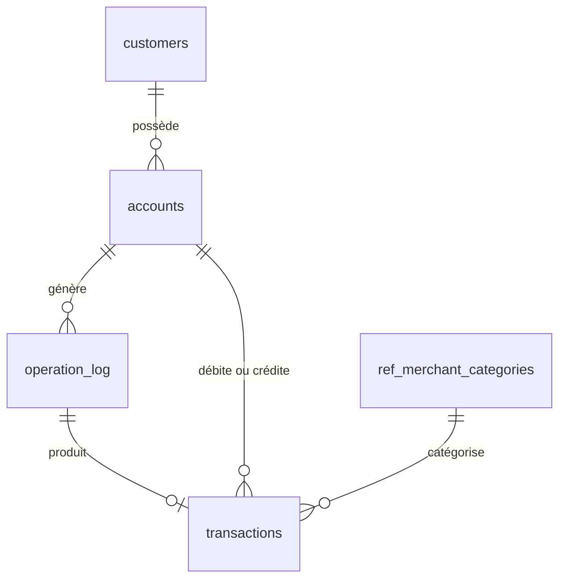
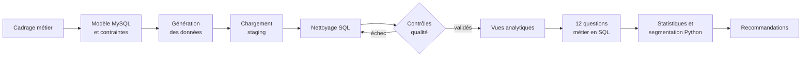
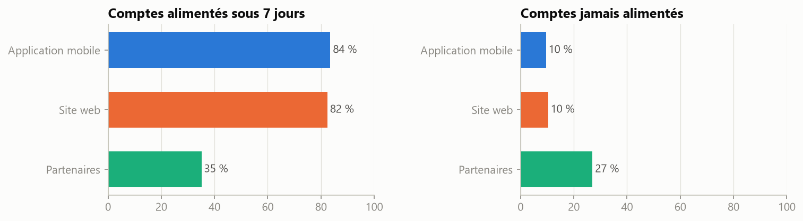
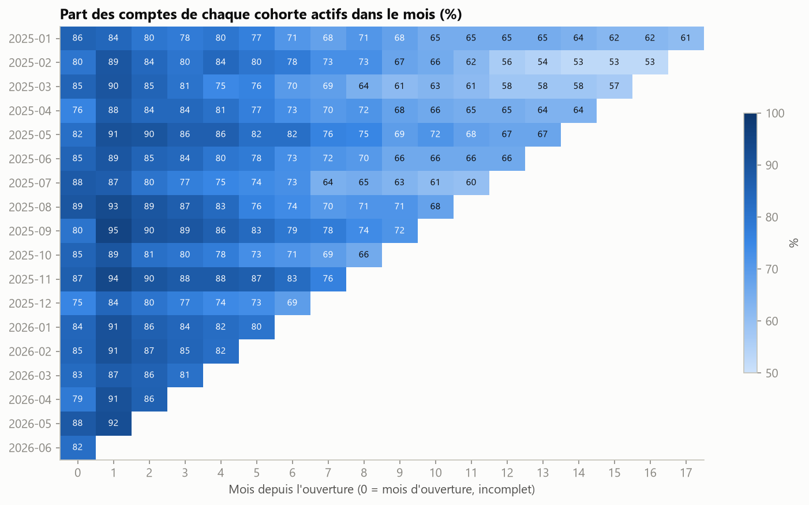
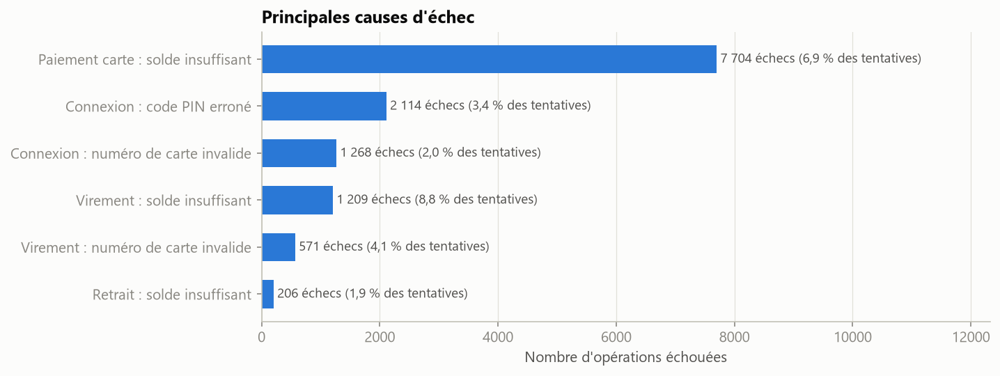
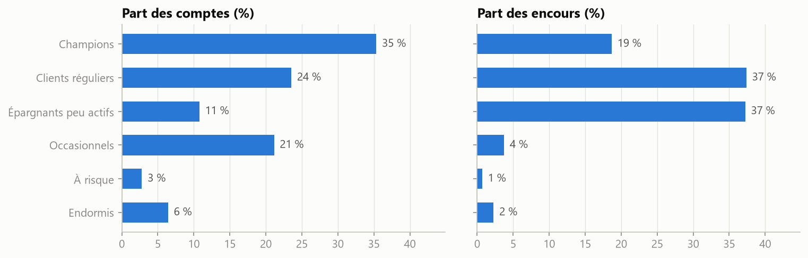

# SBS Bank : analyse de l'activité clients d'une néobanque avec SQL et Python


Projet de Data Analyst mené de bout en bout : d'une application bancaire qui produit les données jusqu'aux recommandations présentées à la direction.

## En bref

| | |
|---|---|
| **Contexte** | SBS Bank, néobanque fictive lancée en janvier 2025, s'interroge après 18 mois sur la qualité de sa croissance |
| **Problématique** | La croissance repose-t-elle sur des clients qui utilisent réellement leur compte, et où agir en priorité ? |
| **Données** | 1 800 clients, 1 881 comptes, environ 254 000 opérations et 141 000 transactions, plus un export CRM à nettoyer |
| **Démarche** | Cadrage, modélisation MySQL, chargement, nettoyage SQL, contrôles qualité, 12 questions métier en SQL, statistiques et segmentation en Python |
| **Résultat clé** | Les clients apportés par les partenaires sont 2,4 fois moins nombreux à alimenter leur compte sous 7 jours (35 % contre 84 %) |
| **Livrables** | Base documentée, requêtes SQL, notebook commenté, 6 recommandations priorisées, listes d'actions pour le CRM |

## Sommaire

1. [Contexte métier](#1-contexte-métier)
2. [Problématique et objectifs](#2-problématique-et-objectifs)
3. [Données utilisées et origine](#3-données-utilisées-et-origine)
4. [Structure et modèle des données](#4-structure-et-modèle-des-données)
5. [Démarche et méthodologie](#5-démarche-et-méthodologie)
6. [Étapes du projet](#6-étapes-du-projet)
7. [Outils et technologies](#7-outils-et-technologies)
8. [Rôle de SQL et de Python](#8-rôle-de-sql-et-de-python)
9. [Analyses réalisées](#9-analyses-réalisées)
10. [Principaux résultats](#10-principaux-résultats)
11. [Enseignements](#11-enseignements)
12. [Recommandations métier](#12-recommandations-métier)
13. [Limites](#13-limites)
14. [Pistes d'amélioration](#14-pistes-damélioration)
15. [Structure du dépôt](#15-structure-du-dépôt)
16. [Installation et exécution](#16-installation-et-exécution)
17. [Compétences démontrées](#17-compétences-démontrées)

## 1. Contexte métier

SBS Bank est une néobanque fictive. Chaque client ouvre un compte associé à une carte de paiement et le gère depuis l'application : consultation du solde, dépôts, virements entre clients, retraits et clôture. Les clients arrivent par trois canaux : l'application mobile, le site web et des partenaires commerciaux rémunérés à chaque ouverture de compte.

Après 18 mois, le nombre de comptes progresse régulièrement. La direction veut cependant savoir si ces nouveaux comptes sont réellement utilisés, si les clients restent actifs dans la durée et quels irritants dégradent leur expérience.

Le projet part d'un exercice de cours (un système bancaire en ligne de commande avec validation des numéros de carte par l'algorithme de Luhn, voir [la consigne initiale](docs/00_consigne_initiale.txt)) et le transforme en cas d'usage professionnel complet.

## 2. Problématique et objectifs

> **La croissance de SBS Bank repose-t-elle sur des clients qui utilisent réellement leur compte, et quels leviers actionner en priorité pour améliorer l'activation, la rétention et la qualité de service ?**

Objectifs de l'analyse :

- **Mesurer** la santé du portefeuille : comptes actifs, dormants, jamais alimentés, clôturés.
- **Comparer** les canaux d'acquisition sur l'activation réelle des comptes, et pas seulement sur le nombre d'ouvertures.
- **Suivre** la rétention des clients mois après mois, par cohorte d'ouverture.
- **Identifier** où se concentrent la valeur (encours, dépenses) et les échecs (refus, erreurs de saisie).
- **Cibler** les clients à accompagner avec une segmentation directement exploitable.

Le cadrage complet (parties prenantes, 12 questions, définitions des indicateurs) est détaillé dans [docs/01_cadrage_metier.md](docs/01_cadrage_metier.md).

## 3. Données utilisées et origine

Les données bancaires réelles étant confidentielles, les données sont **simulées**, mais pas tirées au hasard :

- **Données opérationnelles** : un simulateur modélise 5 profils de comportement (salarié, occasionnel, épargnant, client qui décroche, client jamais activé), la saisonnalité, une campagne d'acquisition et des erreurs humaines (faute de frappe sur un numéro de carte, code PIN erroné, montant supérieur au solde). Chaque intention est rejouée **à travers les mêmes règles métier que l'application** : les refus et les soldes résultent des règles, comme en production.
- **Export CRM** : un fichier clients volontairement imparfait, comme on en rencontre en entreprise : doublons, casse et espaces incohérents, emails invalides, dates dans deux formats, 13 orthographes pour 3 canaux, alias de villes.

| Source | Format | Volume |
|---|---|---:|
| Export CRM clients | CSV (séparateur `;`) | 1 885 lignes pour 1 800 clients |
| Comptes | CSV | 1 881 |
| Journal des opérations | CSV | environ 254 000 |
| Transactions | CSV | environ 141 000 |

Période couverte : du 1er janvier 2025 au 30 juin 2026. La génération est reproductible (graine fixe) et les fichiers ne sont pas versionnés : une commande suffit à les recréer.

## 4. Structure et modèle des données



| Couche | Objets | Rôle |
|---|---|---|
| Staging | `stg_customers_raw` | Export CRM brut, conservé pour tracer le nettoyage |
| Opérationnelle | `customers`, `accounts`, `operation_log`, `transactions` | Données propres, protégées par des contraintes (clés, `CHECK`) |
| Référentiel | `ref_merchant_categories`, `ref_analysis_period` | Catégories de dépenses, période et seuil de dormance |
| Analytique | `v_account_activity`, `v_monthly_kpis` | Vues qui portent les définitions métier |

Deux choix structurants :

- **Le journal `operation_log` enregistre chaque tentative**, réussie ou non, avec le motif d'échec. Sans lui, impossible de mesurer la qualité de service.
- **La table `transactions` ne contient que les mouvements d'argent réels.** Les soldes peuvent ainsi être recalculés et contrôlés.

Description de chaque colonne : [docs/02_dictionnaire_donnees.md](docs/02_dictionnaire_donnees.md).

## 5. Démarche et méthodologie



Principes suivis :

- **Partir des décisions à éclairer**, pas des données disponibles.
- **Définir chaque indicateur une seule fois**, dans une vue SQL partagée par toutes les analyses.
- **Ne jamais analyser avant d'avoir contrôlé** : le pipeline s'arrête si un contrôle d'intégrité échoue.
- **Ne rien supprimer silencieusement** : une valeur inexploitable devient NULL et l'anomalie est tracée.
- **Vérifier la significativité** d'un écart avant d'en tirer une conclusion.
- **Confronter chaque chiffre à sa définition** : cette vérification a permis de détecter et corriger une incohérence de la simulation (voir [docs/03_methodologie_et_choix.md](docs/03_methodologie_et_choix.md)).

## 6. Étapes du projet

| # | Étape | Réalisation | Fichiers |
|---|---|---|---|
| 1 | Cadrage | Problématique, questions, définitions des KPI | `docs/01_cadrage_metier.md` |
| 2 | Application bancaire | Luhn, PIN haché, règles métier partagées, transactions atomiques, journal des opérations | `src/sbs_bank/` |
| 3 | Modélisation | Schéma relationnel, contraintes d'intégrité, référentiels | `sql/01_schema.sql` |
| 4 | Données | Simulation comportementale de 18 mois, export CRM imparfait | `src/sbs_bank/simulation.py` |
| 5 | Chargement | Pipeline Python, chargement par lots | `src/sbs_bank/pipeline.py` |
| 6 | Préparation | Normalisation, validation, dédoublonnage en SQL | `sql/02_clean_customers.sql` |
| 7 | Qualité | 10 contrôles d'intégrité et bilan du nettoyage | `sql/03_data_quality_checks.sql`, `reports/data_quality_report.md` |
| 8 | Couche analytique | Vues par compte et par mois | `sql/04_analytics_views.sql` |
| 9 | Analyse | 12 questions métier, test statistique, cohortes, segmentation RFM | `sql/05_business_analysis.sql`, `notebooks/` |
| 10 | Restitution | Graphiques, recommandations, listes d'actions | `reports/`, ce README |
| 11 | Fiabilité | 16 tests unitaires et d'intégration | `tests/` |

## 7. Outils et technologies

| Domaine | Outils |
|---|---|
| Base de données | MySQL 9.6 via WampServer |
| Langages | SQL, Python 3.12 |
| Accès aux données | PyMySQL, SQLAlchemy |
| Analyse | pandas, NumPy, SciPy |
| Visualisation | Matplotlib |
| Génération de données | Faker, NumPy |
| Notebook | Jupyter |
| Tests | pytest |
| IDE | PyCharm Professional (Python, SQL, notebooks et Git dans un seul outil) |
| Versionnement | Git, GitHub |

## 8. Rôle de SQL et de Python

Chaque traitement est fait là où il est le plus simple, le plus fiable et le plus lisible.

| SQL (MySQL) | Python |
|---|---|
| Garantir l'intégrité (clés, contraintes `CHECK`) | Faire fonctionner l'application bancaire |
| Nettoyer et dédoublonner des données déjà en base | Simuler des comportements clients |
| Contrôler la qualité, y compris l'algorithme de Luhn recalculé en SQL | Lire les fichiers et charger la base par lots |
| Porter les définitions métier dans des vues | Réaliser les tests statistiques (khi-deux, V de Cramér) |
| Agréger : CTE, fonctions de fenêtre (`LAG`, `NTILE`, `RANK`, sommes cumulées), cohortes, CTE récursive | Segmenter les clients (scoring RFM) |
| | Produire les graphiques et les exports |

Les requêtes restent dans des fichiers `.sql` et le notebook les exécute par leur nom : **le SQL est la source unique**, lisible et exécutable directement dans l'IDE.

## 9. Analyses réalisées

| # | Question métier | Technique |
|---|---|---|
| Q1 | Situation du portefeuille | Agrégation conditionnelle |
| Q2 | Croissance et activité mensuelle | Série mensuelle, `LAG`, somme cumulée |
| Q3 | Activation par canal d'acquisition | Taux d'activation, test du khi-deux |
| Q4 | Engagement selon l'âge | Tranches d'âge, répartition des statuts |
| Q5 | Rétention par cohorte | Analyse de cohortes, carte de chaleur |
| Q6 | Concentration des encours | `NTILE`, courbe de concentration |
| Q7 | Dépenses carte par catégorie | Parts du total, `RANK` |
| Q8 | Causes d'échec | Taux d'échec par type et par motif |
| Q9 | Utilité du contrôle de Luhn | Erreurs interceptées avant la base |
| Q10 | Concentration des paiements refusés | Répartition par tranche de refus |
| Q11 | Clients proches de la dormance | Liste d'actions pour le CRM |
| Q12 | Segmentation des clients | Récence, fréquence, montant, solde |

Le notebook [analyse_activite_sbs_bank.ipynb](notebooks/analyse_activite_sbs_bank.ipynb) présente chaque analyse avec son interprétation.

## 10. Principaux résultats

### Indicateurs clés au 30 juin 2026

| Indicateur | Valeur |
|---|---:|
| Comptes ouverts | 1 881 |
| Comptes actifs (activité sur les 90 derniers jours) | 1 410 (75 %) |
| Comptes jamais alimentés | 239 (13 %) |
| Encours total | 4,2 M€ |
| Encours immobilisé sur des comptes dormants | 340 k€ |
| Rétention à 6 mois / 12 mois | 75 % / 63 % |
| Taux de refus des paiements carte (juin 2026) | 5,5 % |
| Erreurs de numéro de carte interceptées par Luhn | 93 % (virements) à 99 % (connexions) |
| Contrôles d'intégrité validés | 10 sur 10 |

### Le canal partenaire amène des clients qui n'activent pas leur compte



35 % des clients venus des partenaires alimentent leur compte sous 7 jours, contre 84 % via le mobile et 82 % via le web ; 27 % ne l'alimentent jamais. L'écart est statistiquement significatif (khi-deux, p < 0,001), alors que mobile et web ne diffèrent pas (p = 0,72).

### Environ un compte sur quatre n'est plus actif après 6 mois



La rétention moyenne passe de 90 % le premier mois à 75 % à 6 mois et 63 % à 12 mois. La cohorte de la campagne de septembre 2025 retient au moins aussi bien que les autres.

### Les paiements refusés sont la première source d'échec



Les refus de paiement pour solde insuffisant représentent 58 % de tous les échecs (environ 520 k€ de paiements non réalisés) et sont concentrés : 18 % des porteurs de carte cumulent 61 % des refus.

### Les encours sont très concentrés, notamment sur des épargnants peu actifs



10 % des comptes détiennent 59 % des encours. Le segment des épargnants peu actifs représente 11 % des comptes mais 37 % des encours, avec une dernière activité remontant à 53 jours en moyenne.

Autres graphiques : [croissance mensuelle](reports/figures/02_croissance_mensuelle.png), [statut des comptes](reports/figures/01_statut_des_comptes.png), [concentration des encours](reports/figures/05_concentration_des_encours.png), [dépenses par catégorie](reports/figures/06_depenses_par_categorie.png).

## 11. Enseignements

- **Le nombre d'ouvertures est un indicateur trompeur.** Il faut piloter l'acquisition sur l'activation : 13 % des comptes acquis n'ont jamais servi.
- **Le problème d'activation est propre au canal partenaire**, pas au digital en général : mobile et web obtiennent des résultats équivalents.
- **La croissance ralentit** (+6 à +8 % de comptes actifs par mois en 2026 contre +20 % à l'été 2025) : la rétention devient un levier aussi important que l'acquisition.
- **L'âge est un mauvais critère de ciblage** : l'engagement varie peu d'une tranche à l'autre.
- **Les irritants sont concentrés**, qu'il s'agisse des refus de paiement ou des encours à risque : des actions ciblées sur une minorité de clients traitent l'essentiel du problème.
- **Un contrôle simple côté application a une vraie valeur** : l'algorithme de Luhn rejette la quasi-totalité des fautes de frappe avant de solliciter la base, avec un retour immédiat pour le client.

## 12. Recommandations métier

| Priorité | Recommandation | Indicateur de suivi |
|:---:|---|---|
| 1 | **Revoir l'activation du canal partenaire** : première alimentation guidée, relances à J+3 et J+7, rémunération des partenaires conditionnée à l'activation | Part des comptes partenaires alimentés sous 7 jours (35 %) |
| 2 | **Réduire les paiements refusés** : alerte de solde bas et découvert encadré pour les clients qui concentrent les refus | Taux de refus carte (5,5 %) |
| 3 | **Sécuriser les encours des épargnants peu actifs** : contact personnalisé, offre d'épargne | Encours du segment (37 % du total) |
| 4 | **Industrialiser la prévention de la dormance** : relance automatique à 45 jours d'inactivité à partir de la liste générée | Comptes basculant en dormance chaque mois |
| 5 | **Reconduire des campagnes du type septembre 2025**, dont les clients restent actifs | Rétention à 6 mois de la cohorte |
| 6 | **Fluidifier la connexion** (biométrie) et conserver le contrôle de Luhn | Taux d'échec de connexion (3,4 % liés au PIN) |

Les listes d'actions sont prêtes à l'emploi : [clients proches de la dormance](reports/liste_prevention_dormance.csv) et [segmentation de chaque compte](reports/segmentation_rfm.csv).

## 13. Limites

- **Données simulées** : les tendances reflètent les hypothèses de la simulation. La démarche, les définitions et les requêtes sont en revanche directement transposables à des données réelles.
- **Pas de données financières d'acquisition ni de revenus** : la rentabilité par canal ne peut pas être calculée.
- **Choix métier à valider** : le seuil de dormance (90 jours) et les règles de segmentation devraient être arbitrés avec les équipes concernées.
- **Cohortes** : le mois d'ouverture est incomplet, ce qui explique une rétention M0 inférieure à M1.

## 14. Pistes d'amélioration

- Tableau de bord interactif (Power BI, Metabase) branché sur les vues SQL.
- Modèle prédictif de dormance (régression logistique) à partir des variables d'activité.
- Test A/B des relances d'activation sur le canal partenaire.
- Orchestration planifiée du pipeline et historisation mensuelle des indicateurs.
- Intégration continue (GitHub Actions) avec un service MySQL pour exécuter les tests à chaque push.
- Ajout du coût d'acquisition par canal pour mesurer la rentabilité.

## 15. Structure du dépôt

```text
.
├── README.md
├── requirements.txt              Dépendances Python
├── pyproject.toml                Package sbs_bank et configuration pytest
├── .env.example                  Modèle de configuration de la connexion MySQL
├── data/raw/                     Données générées (non versionnées, recréées par le pipeline)
├── docs/
│   ├── 00_consigne_initiale.txt  Exercice de départ
│   ├── 01_cadrage_metier.md      Problématique, questions, définitions des KPI
│   ├── 02_dictionnaire_donnees.md Modèle et description des colonnes
│   ├── 03_methodologie_et_choix.md Démarche, choix techniques, rôle de SQL et Python
│   └── 04_environnement_pycharm_wampserver.md Installation pas à pas
├── sql/
│   ├── 00_create_database.sql    Création de la base
│   ├── 01_schema.sql             Tables, contraintes, référentiels
│   ├── 02_clean_customers.sql    Nettoyage et dédoublonnage de l'export CRM
│   ├── 03_data_quality_checks.sql Contrôles qualité
│   ├── 04_analytics_views.sql    Vues analytiques et définitions métier
│   └── 05_business_analysis.sql  12 questions métier
├── src/sbs_bank/
│   ├── luhn.py                   Génération et validation des numéros de carte
│   ├── security.py               Hachage des codes PIN
│   ├── rules.py                  Règles métier partagées
│   ├── bank.py                   Service bancaire transactionnel
│   ├── cli.py                    Interface en ligne de commande
│   ├── simulation.py             Simulation de 18 mois d'activité
│   ├── pipeline.py               Génération, chargement, contrôles
│   ├── analysis.py               Outils du notebook (requêtes nommées, style)
│   ├── config.py, db.py          Configuration et accès MySQL
├── notebooks/
│   └── analyse_activite_sbs_bank.ipynb Analyse commentée
├── reports/
│   ├── data_quality_report.md    Rapport qualité généré
│   ├── figures/                  Graphiques
│   ├── liste_prevention_dormance.csv
│   └── segmentation_rfm.csv
└── tests/                        Tests unitaires et d'intégration
```

## 16. Installation et exécution

Prérequis : Python 3.11 ou plus récent, MySQL 8.0 ou plus récent (WampServer démarré). Guide détaillé pour PyCharm et WampServer : [docs/04_environnement_pycharm_wampserver.md](docs/04_environnement_pycharm_wampserver.md).

```bash
git clone https://github.com/GomuGomuNo01/Simple-Banking-System-Python-.git
cd Simple-Banking-System-Python-
python -m venv .venv
.venv\Scripts\activate
python -m pip install -r requirements.txt
python -m pip install -e .
copy .env.example .env
```

Construire la base et les données (environ 1 à 2 minutes) :

```bash
python -m sbs_bank.pipeline all
```

Lancer les tests :

```bash
python -m pytest
```

Utiliser l'application bancaire :

```bash
python -m sbs_bank.cli
```

Réexécuter l'analyse :

```bash
jupyter nbconvert --to notebook --execute --inplace notebooks/analyse_activite_sbs_bank.ipynb
```

## 17. Compétences démontrées

| Compétence Data Analyst | Mise en œuvre dans le projet |
|---|---|
| Compréhension d'un besoin métier | Problématique, parties prenantes, questions et indicateurs formalisés avant l'analyse |
| Modélisation de données | Schéma relationnel en couches, clés, contraintes d'intégrité |
| SQL avancé | CTE, CTE récursive, fonctions de fenêtre, agrégations conditionnelles, analyse de cohortes, vues |
| Préparation et qualité des données | Nettoyage, normalisation, dédoublonnage, traçabilité des anomalies, contrôles bloquants |
| Python pour la donnée | pandas, chargement par lots, requêtes paramétrées, automatisation d'un pipeline |
| Statistiques | Test du khi-deux, V de Cramér, analyse de distribution et de concentration |
| Segmentation client | Scoring RFM enrichi du solde, profils de segments |
| Visualisation | Graphiques choisis selon le message, lisibles et accessibles |
| Esprit critique | Détection et correction d'une incohérence en confrontant les chiffres à leurs définitions |
| Restitution | Interprétations, recommandations priorisées avec indicateurs de suivi, listes d'actions |
| Bonnes pratiques | Tests automatisés, reproductibilité, secrets hors du code, Git avec commits thématiques |

## Auteur

**Auteur** : Dibie Elisee Jules Cedric KOUADIO ([@GomuGomuNo01](https://github.com/GomuGomuNo01))
