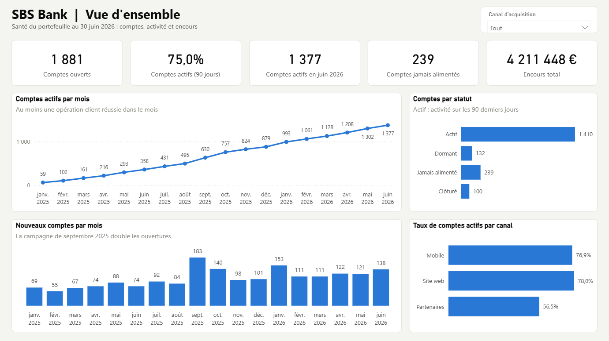
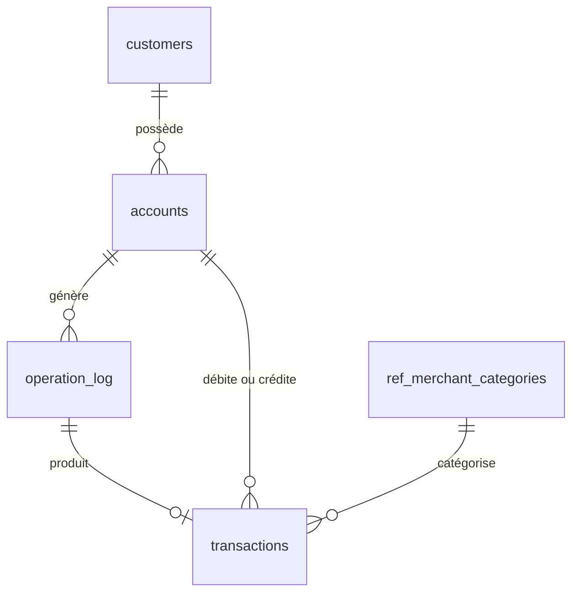
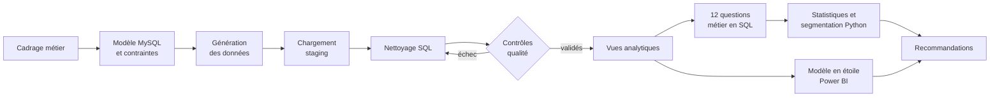
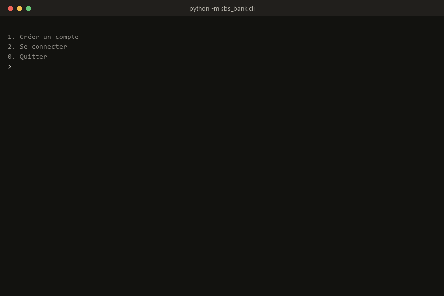
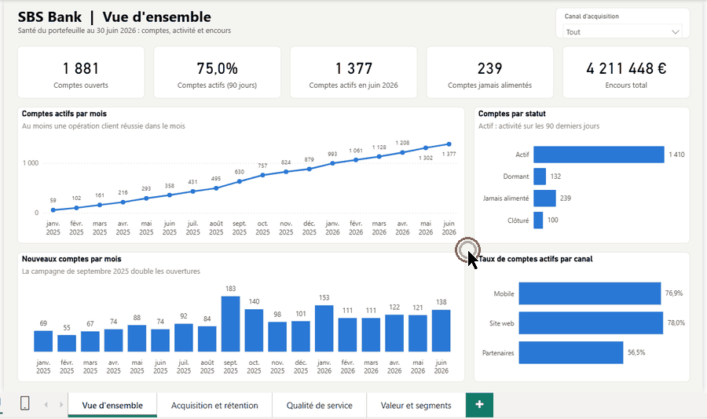
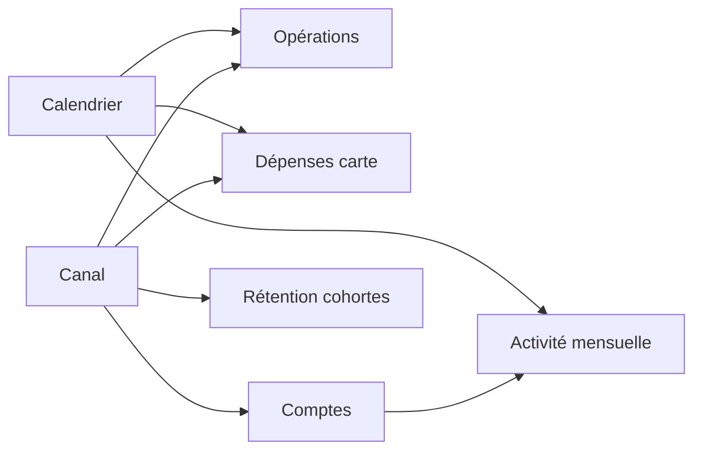
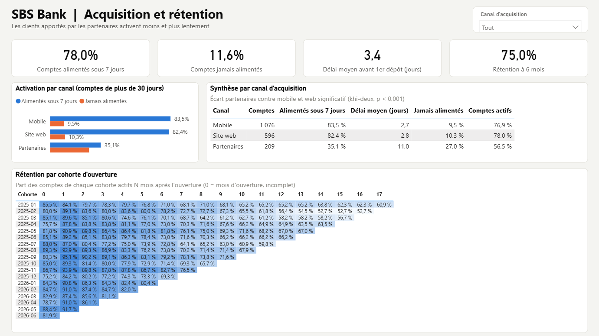
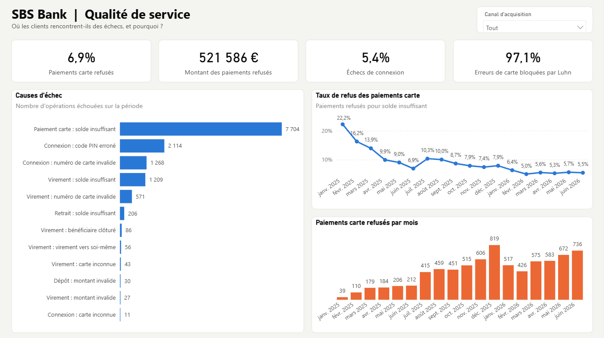
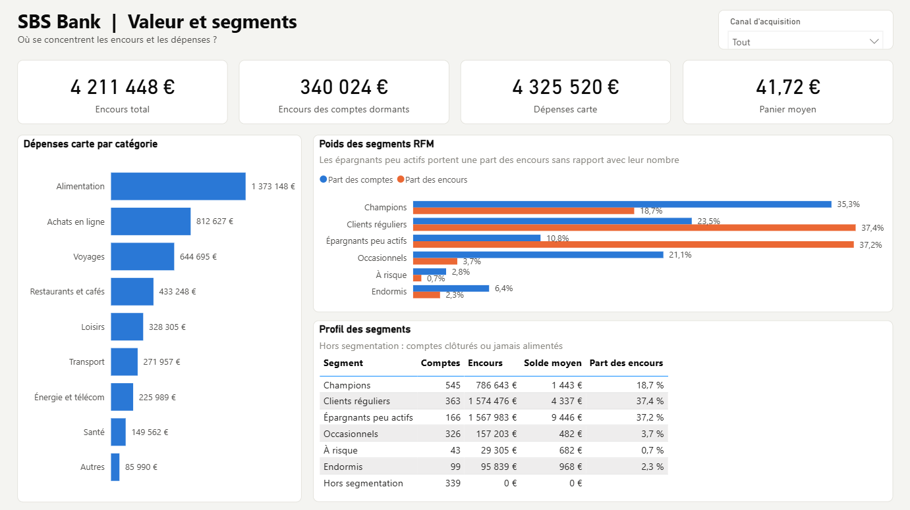

# SBS Bank : analyse de l'activité clients d'une néobanque avec SQL, Python et Power BI


Projet de Data Analyst mené de bout en bout : d'une application bancaire qui produit les données jusqu'au tableau de bord et aux recommandations présentés à la direction.

[](https://github.com/GomuGomuNo01/Simple-Banking-System-Python/releases/latest/download/SBS_Bank.pbix)

*Fichier unique, données incluses, ouverture directe dans Power BI Desktop sans configuration. Toutes les versions sont disponibles sur la [page des releases](https://github.com/GomuGomuNo01/Simple-Banking-System-Python/releases).*

## En bref

| | |
|---|---|
| **Contexte** | SBS Bank, néobanque fictive lancée en janvier 2025, s'interroge après 18 mois sur la qualité de sa croissance |
| **Problématique** | La croissance repose-t-elle sur des clients qui utilisent réellement leur compte, et où agir en priorité ? |
| **Données** | 1 800 clients, 1 881 comptes, environ 254 000 opérations et 141 000 transactions, plus un export CRM à nettoyer |
| **Démarche** | Cadrage, modélisation MySQL, nettoyage et contrôles qualité en SQL, 12 questions métier, statistiques et segmentation en Python, tableau de bord Power BI |
| **Résultat clé** | Les clients apportés par les partenaires sont 2,4 fois moins nombreux à alimenter leur compte sous 7 jours (35 % contre 84 %) |
| **Livrables** | Base documentée, requêtes SQL, notebook commenté, tableau de bord Power BI de 4 pages, 6 recommandations priorisées, listes d'actions pour le CRM |



## Parcours de lecture

| Profil | Temps | Sections conseillées |
|---|---|---|
| Recruteur, manager, RH | 3 minutes | [En bref](#en-bref), [Principaux résultats](#12-principaux-résultats), [Tableau de bord Power BI](#13-tableau-de-bord-power-bi), [Recommandations](#15-recommandations-métier), [Compétences](#23-compétences-démontrées) |
| Data Analyst, profil technique | 15 minutes | [Modèle des données](#4-structure-et-modèle-des-données), [Qualité des données](#10-préparation-et-qualité-des-données), [requêtes SQL](sql), [notebook](notebooks/analyse_activite_sbs_bank.ipynb), [projet Power BI](powerbi), [tests](#18-fiabilité-et-tests) |

## Sommaire

1. [Contexte métier](#1-contexte-métier)
2. [Problématique et objectifs](#2-problématique-et-objectifs)
3. [Données utilisées et origine](#3-données-utilisées-et-origine)
4. [Structure et modèle des données](#4-structure-et-modèle-des-données)
5. [Démarche et méthodologie](#5-démarche-et-méthodologie)
6. [Étapes du projet](#6-étapes-du-projet)
7. [Outils et technologies](#7-outils-et-technologies)
8. [Rôle de SQL, Python et Power BI](#8-rôle-de-sql-python-et-power-bi)
9. [Application bancaire](#9-application-bancaire)
10. [Préparation et qualité des données](#10-préparation-et-qualité-des-données)
11. [Analyses réalisées](#11-analyses-réalisées)
12. [Principaux résultats](#12-principaux-résultats)
13. [Tableau de bord Power BI](#13-tableau-de-bord-power-bi)
14. [Enseignements](#14-enseignements)
15. [Recommandations métier](#15-recommandations-métier)
16. [Limites](#16-limites)
17. [Pistes d'amélioration](#17-pistes-damélioration)
18. [Fiabilité et tests](#18-fiabilité-et-tests)
19. [Structure du dépôt](#19-structure-du-dépôt)
20. [Installation et exécution](#20-installation-et-exécution)
21. [Documentation](#21-documentation)
22. [Organisation du travail et versionnement](#22-organisation-du-travail-et-versionnement)
23. [Compétences démontrées](#23-compétences-démontrées)
24. [Licence](#licence)
25. [Auteur](#auteur)

## 1. Contexte métier

SBS Bank est une néobanque fictive. Chaque client ouvre un compte associé à une carte de paiement et le gère depuis l'application : consultation du solde, dépôts, virements entre clients, retraits et clôture. Les clients arrivent par trois canaux : l'application mobile, le site web et des partenaires commerciaux rémunérés à chaque ouverture de compte.

Après 18 mois, le nombre de comptes progresse régulièrement. La direction veut cependant savoir si ces nouveaux comptes sont réellement utilisés, si les clients restent actifs dans la durée et quels irritants dégradent leur expérience.

Le projet part d'un exercice de cours (un système bancaire en ligne de commande avec validation des numéros de carte par l'algorithme de Luhn, voir [la consigne initiale](docs/00_consigne_initiale.txt)) et le transforme en cas d'usage professionnel complet :

| Consigne initiale | Projet final |
|---|---|
| Menu en ligne de commande | Application enrichie, transactionnelle et sécurisée |
| Une table `card` avec le PIN en clair | Modèle relationnel en couches, PIN haché, contraintes d'intégrité |
| SQLite | MySQL (WampServer) |
| Aucune analyse | 18 mois d'activité, 12 questions métier, statistiques, segmentation, tableau de bord Power BI, recommandations |

## 2. Problématique et objectifs

> **La croissance de SBS Bank repose-t-elle sur des clients qui utilisent réellement leur compte, et quels leviers actionner en priorité pour améliorer l'activation, la rétention et la qualité de service ?**

Objectifs de l'analyse :

- **Mesurer** la santé du portefeuille : comptes actifs, dormants, jamais alimentés, clôturés.
- **Comparer** les canaux d'acquisition sur l'activation réelle des comptes, et pas seulement sur le nombre d'ouvertures.
- **Suivre** la rétention des clients mois après mois, par cohorte d'ouverture.
- **Identifier** où se concentrent la valeur (encours, dépenses) et les échecs (refus, erreurs de saisie).
- **Cibler** les clients à accompagner avec une segmentation directement exploitable.
- **Outiller le pilotage** avec un tableau de bord que la direction peut consulter sans code.

Le cadrage complet (parties prenantes, 12 questions, définitions des indicateurs) est détaillé dans [docs/01_cadrage_metier.md](docs/01_cadrage_metier.md).

## 3. Données utilisées et origine

Les données bancaires réelles étant confidentielles, les données sont **simulées**, mais pas tirées au hasard :

- **Données opérationnelles** : un simulateur modélise 5 profils de comportement (salarié, occasionnel, épargnant, client qui décroche, client jamais activé), la saisonnalité, une campagne d'acquisition et des erreurs humaines (faute de frappe sur un numéro de carte, code PIN erroné, montant supérieur au solde). Chaque intention est rejouée **à travers les mêmes règles métier que l'application** : les refus et les soldes résultent des règles, comme en production.
- **Export CRM** : un fichier clients volontairement imparfait, comme on en rencontre en entreprise : doublons, casse et espaces incohérents, emails invalides, dates dans deux formats, 13 orthographes pour 3 canaux, alias de villes.

| Source | Format | Volume |
|---|---|---:|
| Export CRM clients | CSV (séparateur `;`) | 1 885 lignes pour 1 800 clients |
| Comptes | CSV | 1 881 |
| Journal des opérations | CSV | environ 254 000 |
| Transactions | CSV | environ 141 000 |

Période couverte : du 1er janvier 2025 au 30 juin 2026. La génération est reproductible (graine fixe) : les fichiers bruts ne sont pas versionnés, une commande suffit à les recréer.

## 4. Structure et modèle des données



| Couche | Objets | Rôle |
|---|---|---|
| Staging | `stg_customers_raw` | Export CRM brut, conservé pour tracer le nettoyage |
| Opérationnelle | `customers`, `accounts`, `operation_log`, `transactions` | Données propres, protégées par des contraintes (clés, `CHECK`) |
| Référentiel | `ref_merchant_categories`, `ref_analysis_period` | Catégories de dépenses, période et seuil de dormance |
| Analytique | `v_account_activity`, `v_monthly_kpis` | Vues qui portent les définitions métier |
| Pilotage | Modèle en étoile Power BI | 3 dimensions et 4 tables de faits exportées depuis les vues |

Deux choix structurants :

- **Le journal `operation_log` enregistre chaque tentative**, réussie ou non, avec le motif d'échec. Sans lui, impossible de mesurer la qualité de service.
- **La table `transactions` ne contient que les mouvements d'argent réels.** Les soldes peuvent ainsi être recalculés et contrôlés.

Description de chaque colonne : [docs/02_dictionnaire_donnees.md](docs/02_dictionnaire_donnees.md).

## 5. Démarche et méthodologie



Principes suivis :

- **Partir des décisions à éclairer**, pas des données disponibles.
- **Définir chaque indicateur une seule fois**, dans une vue SQL partagée par le notebook et le tableau de bord.
- **Ne jamais analyser avant d'avoir contrôlé** : le pipeline s'arrête si un contrôle d'intégrité échoue.
- **Ne rien supprimer silencieusement** : une valeur inexploitable devient NULL et l'anomalie est tracée.
- **Vérifier la significativité** d'un écart avant d'en tirer une conclusion.
- **Confronter chaque chiffre à sa définition** : cette vérification a permis de détecter et corriger une incohérence de la simulation (voir [docs/03_methodologie_et_choix.md](docs/03_methodologie_et_choix.md)).

## 6. Étapes du projet

| # | Étape | Réalisation | Fichiers |
|---|---|---|---|
| 1 | Cadrage | Problématique, questions, définitions des KPI | `docs/01_cadrage_metier.md` |
| 2 | Application bancaire | Luhn, PIN haché, règles métier partagées, transactions atomiques, journal des opérations | `src/sbs_bank/` |
| 3 | Modélisation | Schéma relationnel, contraintes d'intégrité, référentiels | `sql/01_schema.sql` |
| 4 | Données | Simulation comportementale de 18 mois, export CRM imparfait | `src/sbs_bank/simulation.py` |
| 5 | Chargement | Pipeline Python, chargement par lots | `src/sbs_bank/pipeline.py` |
| 6 | Préparation | Normalisation, validation, dédoublonnage en SQL | `sql/02_clean_customers.sql` |
| 7 | Qualité | 10 contrôles d'intégrité et bilan du nettoyage | `sql/03_data_quality_checks.sql`, `reports/data_quality_report.md` |
| 8 | Couche analytique | Vues par compte et par mois | `sql/04_analytics_views.sql` |
| 9 | Analyse | 12 questions métier, test statistique, cohortes, segmentation RFM | `sql/05_business_analysis.sql`, `notebooks/` |
| 10 | Tableau de bord | Export en étoile, modèle sémantique, 30 mesures DAX, rapport de 4 pages | `sql/06_powerbi_export.sql`, `powerbi/` |
| 11 | Restitution | Graphiques, recommandations, listes d'actions | `reports/`, ce README |
| 12 | Fiabilité | 18 tests unitaires et d'intégration | `tests/` |

## 7. Outils et technologies

| Domaine | Outils |
|---|---|
| Base de données | MySQL 9.6 via WampServer |
| Langages | SQL, Python 3.12, DAX, Power Query (M) |
| Accès aux données | PyMySQL, SQLAlchemy |
| Analyse | pandas, NumPy, SciPy |
| Visualisation | Matplotlib |
| Business Intelligence | Power BI Desktop (projet PBIP : modèle TMDL, rapport PBIR) |
| Génération de données | Faker, NumPy |
| Notebook | Jupyter |
| Tests | pytest |
| IDE | PyCharm Professional (Python, SQL, notebooks et Git dans un seul outil) |
| Versionnement | Git, GitHub (branches protégées, pull requests) |

## 8. Rôle de SQL, Python et Power BI

Chaque traitement est fait là où il est le plus simple, le plus fiable et le plus lisible.

| SQL (MySQL) | Python | Power BI |
|---|---|---|
| Garantir l'intégrité (clés, contraintes `CHECK`) | Faire fonctionner l'application bancaire | Modéliser en étoile pour le pilotage |
| Nettoyer et dédoublonner des données déjà en base | Simuler des comportements clients | Calculer les indicateurs en DAX |
| Contrôler la qualité, y compris l'algorithme de Luhn recalculé en SQL | Lire les fichiers et charger la base par lots | Rendre les analyses filtrables par un utilisateur métier |
| Porter les définitions métier dans des vues | Réaliser les tests statistiques (khi-deux, V de Cramér) | Offrir un suivi mensuel sans code |
| Agréger : CTE, fonctions de fenêtre (`LAG`, `NTILE`, `RANK`, sommes cumulées), cohortes, CTE récursive | Segmenter les clients (scoring RFM) | |
| Préparer les tables de faits du tableau de bord | Produire les graphiques et les exports | |

Les requêtes restent dans des fichiers `.sql` et le notebook les exécute par leur nom : **le SQL est la source unique**, lisible et exécutable directement dans l'IDE. La segmentation RFM est une fonction Python unique, utilisée à la fois par le notebook et par l'export Power BI : les deux restitutions affichent exactement les mêmes chiffres.

## 9. Application bancaire

L'application en ligne de commande est le système opérationnel qui alimente la base. Elle reprend le menu de la consigne initiale et l'enrichit.



*Session réelle enregistrée sur une base de démonstration jetable : création de deux comptes, code PIN refusé, dépôt, virement bloqué par le contrôle de Luhn après une faute de frappe, puis virement accepté, retrait et solde. Les numéros de carte et les codes PIN affichés sont fictifs et la base est supprimée à la fin de l'enregistrement.*

| Menu principal | Menu du compte connecté |
|---|---|
| Créer un compte (carte et code PIN générés) | Consulter le solde |
| Se connecter | Ajouter des fonds |
| Quitter | Effectuer un virement vers une autre carte |
| | Retirer des fonds |
| | Clôturer le compte |
| | Se déconnecter |

| Choix technique | Problème résolu |
|---|---|
| Numéro de carte à 16 chiffres validé par l'algorithme de Luhn | Rejeter une faute de frappe immédiatement, sans requête en base |
| Code PIN haché avec sel (PBKDF2-SHA256, 600 000 itérations) | Un vol de la base ne révèle pas les codes PIN |
| Requêtes paramétrées | Protection contre l'injection SQL |
| Journal de chaque tentative, réussie ou non | Mesurer les échecs, pas seulement les succès |
| Transaction unique pour le journal, le solde et le mouvement | Pas d'état intermédiaire en cas d'erreur |
| Verrous `SELECT ... FOR UPDATE` dans un ordre fixe | Pas de solde corrompu ni de blocage lors de virements simultanés |
| Clôture logique plutôt que suppression | Historique conservé pour l'audit et l'analyse |
| Règles métier dans un module partagé avec la simulation | Données simulées produites par exactement les mêmes contrôles |
| Paramètres de connexion dans un fichier `.env` non versionné | Aucun secret dans le code ni dans Git |

## 10. Préparation et qualité des données

**Nettoyage de l'export CRM, réalisé en SQL** ([sql/02_clean_customers.sql](sql/02_clean_customers.sql)) :

| Anomalie détectée dans l'export brut | Volume | Traitement |
|---|---:|---|
| Doublons (anciennes versions ou copies) | 85 lignes | Conservation de la version la plus récente (`ROW_NUMBER`) |
| Orthographes différentes du canal d'inscription | 13 variantes | Ramenées à 3 valeurs |
| Dates de naissance au format JJ/MM/AAAA | 466 | Converties au format date |
| Noms et prénoms avec espaces ou casse incohérente | 385 | Normalisés |
| Emails en majuscules ou avec espaces | 136 | Normalisés |
| Villes non normalisées ou alias | 268 | Normalisées |
| Emails invalides | 16 | Mis à NULL et signalés dans `dq_flags` |
| Dates de naissance absentes ou aberrantes | 51 et 10 | Mises à NULL et signalées |

Résultat : **1 885 lignes brutes, 1 800 clients uniques**, aucune ligne supprimée sans trace.

**Contrôles d'intégrité** ([sql/03_data_quality_checks.sql](sql/03_data_quality_checks.sql)), exécutés avant toute analyse : **10 contrôles sur 10 validés**, dont la concordance des soldes avec la somme des transactions, la validité des numéros de carte (algorithme de Luhn recalculé en SQL), l'absence de solde négatif et l'absence d'opération hors de la période de vie d'un compte. Le détail est publié dans [reports/data_quality_report.md](reports/data_quality_report.md).

## 11. Analyses réalisées

| # | Question métier | Technique |
|---|---|---|
| Q1 | Situation du portefeuille | Agrégation conditionnelle |
| Q2 | Croissance et activité mensuelle | Série mensuelle, `LAG`, somme cumulée |
| Q3 | Activation par canal d'acquisition | Taux d'activation, test du khi-deux |
| Q4 | Engagement selon l'âge | Tranches d'âge, répartition des statuts |
| Q5 | Rétention par cohorte | Analyse de cohortes, carte de chaleur |
| Q6 | Concentration des encours | `NTILE`, courbe de concentration |
| Q7 | Dépenses carte par catégorie | Parts du total, `RANK` |
| Q8 | Causes d'échec | Taux d'échec par type et par motif |
| Q9 | Utilité du contrôle de Luhn | Erreurs interceptées avant la base |
| Q10 | Concentration des paiements refusés | Répartition par tranche de refus |
| Q11 | Clients proches de la dormance | Liste d'actions pour le CRM |
| Q12 | Segmentation des clients | Récence, fréquence, montant, solde |

Le notebook [analyse_activite_sbs_bank.ipynb](notebooks/analyse_activite_sbs_bank.ipynb) présente chaque analyse avec son interprétation.

## 12. Principaux résultats

### Indicateurs clés au 30 juin 2026

| Indicateur | Valeur |
|---|---:|
| Comptes ouverts | 1 881 |
| Comptes actifs (activité sur les 90 derniers jours) | 1 410 (75 %) |
| Comptes actifs en juin 2026 | 1 377 |
| Comptes jamais alimentés | 239 (13 %) |
| Encours total | 4,2 M€ |
| Encours immobilisé sur des comptes dormants | 340 k€ |
| Rétention à 6 mois / 12 mois | 75 % / 63 % |
| Taux de refus des paiements carte (juin 2026) | 5,5 % |
| Erreurs de numéro de carte interceptées par Luhn | 93 % (virements) à 99 % (connexions) |
| Contrôles d'intégrité validés | 10 sur 10 |

### Le canal partenaire amène des clients qui n'activent pas leur compte


35 % des clients venus des partenaires alimentent leur compte sous 7 jours, contre 84 % via le mobile et 82 % via le web ; 27 % ne l'alimentent jamais. L'écart est statistiquement significatif (khi-deux, p < 0,001), alors que mobile et web ne diffèrent pas (p = 0,72).

### Environ un compte sur quatre n'est plus actif après 6 mois


La rétention moyenne passe de 90 % le premier mois à 75 % à 6 mois et 63 % à 12 mois. La cohorte de la campagne de septembre 2025 retient au moins aussi bien que les autres.

### Les paiements refusés sont la première source d'échec


Les refus de paiement pour solde insuffisant représentent 58 % de tous les échecs (environ 520 k€ de paiements non réalisés) et sont concentrés : 18 % des porteurs de carte cumulent 61 % des refus.

### Les encours sont très concentrés, notamment sur des épargnants peu actifs


10 % des comptes détiennent 59 % des encours. Le segment des épargnants peu actifs représente 11 % des comptes mais 37 % des encours, avec une dernière activité remontant à 53 jours en moyenne.

Autres graphiques : [croissance mensuelle](reports/figures/02_croissance_mensuelle.png), [statut des comptes](reports/figures/01_statut_des_comptes.png), [concentration des encours](reports/figures/05_concentration_des_encours.png), [dépenses par catégorie](reports/figures/06_depenses_par_categorie.png).

## 13. Tableau de bord Power BI

Le notebook démontre les conclusions ; le tableau de bord permet à la direction de **suivre les mêmes indicateurs chaque mois**, sans code, en filtrant par canal d'acquisition. Les chiffres sont identiques à ceux du notebook, car les deux reposent sur les mêmes vues SQL et la même segmentation.

**Télécharger le rapport :** [SBS_Bank.pbix](https://github.com/GomuGomuNo01/Simple-Banking-System-Python/releases/latest/download/SBS_Bank.pbix) (rapport et données dans un seul fichier, à ouvrir directement dans Power BI Desktop 2.157 ou plus récent).

| Élément | Contenu |
|---|---|
| Fichier prêt à l'emploi | [`SBS_Bank.pbix`](https://github.com/GomuGomuNo01/Simple-Banking-System-Python/releases/latest/download/SBS_Bank.pbix), publié dans les [releases](https://github.com/GomuGomuNo01/Simple-Banking-System-Python/releases) |
| Projet source | [`powerbi/SBS_Bank.pbip`](powerbi) (format projet, versionné dans Git) |
| Modèle | Schéma en étoile : 3 dimensions (Calendrier, Canal, Comptes) et 4 tables de faits |
| Calculs | 30 mesures DAX (`CALCULATE`, `USERELATIONSHIP`, `REMOVEFILTERS`, variables) |
| Pages | Vue d'ensemble, Acquisition et rétention, Qualité de service, Valeur et segments |
| Interaction | Filtre par canal d'acquisition synchronisé sur les 4 pages |



*Navigation réelle dans Power BI Desktop : filtrage sur le canal Partenaires (le portefeuille passe de 1 881 à 209 comptes et le taux de comptes actifs de 75,0 % à 56,5 %), effacement du filtre, puis parcours des quatre pages du rapport.*



### Page 1 : Vue d'ensemble


**Question :** le portefeuille est-il en bonne santé ?

- 1 881 comptes ouverts, 75 % actifs sur les 90 derniers jours et 1 377 comptes actifs en juin 2026.
- 239 comptes n'ont jamais été alimentés : c'est le premier gisement de progrès.
- Le pic d'ouvertures de septembre 2025 correspond à la campagne d'acquisition.
- Les clients partenaires sont nettement moins actifs (56,5 % contre 77 à 78 %).

### Page 2 : Acquisition et rétention



**Question :** quel canal amène des clients qui utilisent réellement leur compte, et combien de temps restent-ils actifs ?

- 35,1 % des comptes partenaires sont alimentés sous 7 jours, contre 83,5 % en mobile et 82,4 % sur le web.
- Le délai moyen avant le premier dépôt est de 11 jours pour les partenaires, contre moins de 3 jours ailleurs.
- La matrice de cohortes montre une rétention de 75 % à 6 mois ; le filtre par canal permet de la comparer d'un canal à l'autre.

### Page 3 : Qualité de service



**Question :** où les clients rencontrent-ils des échecs, et pourquoi ?

- Les paiements carte refusés pour solde insuffisant sont de loin la première cause d'échec (7 704 refus, 521 586 €).
- Le taux de refus baisse de 22 % à environ 5,5 % à mesure que la base de clients mûrit.
- Le contrôle de Luhn bloque 97,1 % des erreurs de numéro de carte avant toute requête en base.

### Page 4 : Valeur et segments



**Question :** où se concentrent les encours et les dépenses ?

- L'alimentation est le premier poste de dépenses carte, devant les achats en ligne et les voyages.
- Les épargnants peu actifs représentent 10,8 % des comptes segmentés mais 37,2 % des encours.
- 340 024 € sont immobilisés sur des comptes dormants.

Détails du modèle, des mesures et de la procédure d'ouverture : [docs/05_tableau_de_bord_power_bi.md](docs/05_tableau_de_bord_power_bi.md).

## 14. Enseignements

- **Le nombre d'ouvertures est un indicateur trompeur.** Il faut piloter l'acquisition sur l'activation : 13 % des comptes acquis n'ont jamais servi.
- **Le problème d'activation est propre au canal partenaire**, pas au digital en général : mobile et web obtiennent des résultats équivalents.
- **La croissance ralentit** (+6 à +8 % de comptes actifs par mois en 2026 contre +20 % à l'été 2025) : la rétention devient un levier aussi important que l'acquisition.
- **L'âge est un mauvais critère de ciblage** : l'engagement varie peu d'une tranche à l'autre.
- **Les irritants sont concentrés**, qu'il s'agisse des refus de paiement ou des encours à risque : des actions ciblées sur une minorité de clients traitent l'essentiel du problème.
- **Un contrôle simple côté application a une vraie valeur** : l'algorithme de Luhn rejette la quasi-totalité des fautes de frappe avant de solliciter la base, avec un retour immédiat pour le client.

## 15. Recommandations métier

| Priorité | Recommandation | Indicateur de suivi |
|:---:|---|---|
| 1 | **Revoir l'activation du canal partenaire** : première alimentation guidée, relances à J+3 et J+7, rémunération des partenaires conditionnée à l'activation | Part des comptes partenaires alimentés sous 7 jours (35 %) |
| 2 | **Réduire les paiements refusés** : alerte de solde bas et découvert encadré pour les clients qui concentrent les refus | Taux de refus carte (5,5 %) |
| 3 | **Sécuriser les encours des épargnants peu actifs** : contact personnalisé, offre d'épargne | Encours du segment (37 % du total) |
| 4 | **Industrialiser la prévention de la dormance** : relance automatique à 45 jours d'inactivité à partir de la liste générée | Comptes basculant en dormance chaque mois |
| 5 | **Reconduire des campagnes du type septembre 2025**, dont les clients restent actifs | Rétention à 6 mois de la cohorte |
| 6 | **Fluidifier la connexion** (biométrie) et conserver le contrôle de Luhn | Taux d'échec de connexion (3,4 % liés au PIN) |

Les indicateurs de suivi sont disponibles dans le tableau de bord Power BI. Les listes d'actions sont prêtes à l'emploi : [clients proches de la dormance](reports/liste_prevention_dormance.csv) et [segmentation de chaque compte](reports/segmentation_rfm.csv).

## 16. Limites

- **Données simulées** : les tendances reflètent les hypothèses de la simulation. La démarche, les définitions et les requêtes sont en revanche directement transposables à des données réelles.
- **Pas de données financières d'acquisition ni de revenus** : la rentabilité par canal ne peut pas être calculée.
- **Choix métier à valider** : le seuil de dormance (90 jours) et les règles de segmentation devraient être arbitrés avec les équipes concernées.
- **Cohortes** : le mois d'ouverture est incomplet, ce qui explique une rétention M0 inférieure à M1.
- **Power BI lit un export figé** (fichiers CSV au 30 juin 2026) et non la base en direct.

## 17. Pistes d'amélioration

- Connexion directe de Power BI à MySQL via une passerelle, publication sur le service Power BI et actualisation planifiée.
- Sécurité au niveau des lignes (RLS) si le rapport est partagé avec des équipes aux périmètres différents.
- Modèle prédictif de dormance (régression logistique) à partir des variables d'activité.
- Test A/B des relances d'activation sur le canal partenaire.
- Orchestration planifiée du pipeline et historisation mensuelle des indicateurs.
- Intégration continue (GitHub Actions) avec un service MySQL pour exécuter les tests à chaque push.
- Ajout du coût d'acquisition par canal pour mesurer la rentabilité.

## 18. Fiabilité et tests

**18 tests automatisés** (pytest), exécutés avec `python -m pytest` :

| Fichier | Tests | Ce qui est vérifié |
|---|---:|---|
| `tests/test_luhn.py` | 4 | Numéros générés valides, détection de toute erreur sur un chiffre et des inversions de chiffres voisins |
| `tests/test_rules_and_security.py` | 5 | Ordre et motifs des règles de connexion, de virement et de débit ; hachage salé des codes PIN |
| `tests/test_simulation.py` | 4 | Soldes égaux à la somme des transactions, cartes uniques et valides, journal chronologique, reproductibilité |
| `tests/test_bank_service.py` | 3 | Parcours client complet sur une vraie base MySQL de test, virement refusé sans effet, contrôles d'intégrité |
| `tests/test_segmentation_and_powerbi.py` | 2 | Règles de segmentation RFM, calendrier du modèle Power BI |

À ces tests s'ajoutent les 10 contrôles d'intégrité de la base, bloquants dans le pipeline, et la vérification des mesures DAX : chaque indicateur du tableau de bord a été comparé aux résultats SQL et au notebook.

## 19. Structure du dépôt

```text
.
├── README.md
├── LICENSE                       Licence MIT
├── requirements.txt              Dépendances Python
├── pyproject.toml                Package sbs_bank et configuration pytest
├── .env.example                  Modèle de configuration de la connexion MySQL
├── data/raw/                     Données générées (non versionnées, recréées par le pipeline)
├── docs/                         Documentation du projet (voir section 21)
├── sql/
│   ├── 00_create_database.sql    Création de la base
│   ├── 01_schema.sql             Tables, contraintes, référentiels
│   ├── 02_clean_customers.sql    Nettoyage et dédoublonnage de l'export CRM
│   ├── 03_data_quality_checks.sql Contrôles qualité
│   ├── 04_analytics_views.sql    Vues analytiques et définitions métier
│   ├── 05_business_analysis.sql  12 questions métier
│   └── 06_powerbi_export.sql     Tables de faits du modèle Power BI
├── src/sbs_bank/
│   ├── luhn.py                   Génération et validation des numéros de carte
│   ├── security.py               Hachage des codes PIN
│   ├── rules.py                  Règles métier partagées
│   ├── bank.py                   Service bancaire transactionnel
│   ├── cli.py                    Interface en ligne de commande
│   ├── simulation.py             Simulation de 18 mois d'activité
│   ├── pipeline.py               Génération, chargement, contrôles, export Power BI
│   ├── analysis.py               Requêtes nommées, style des graphiques, segmentation RFM
│   ├── powerbi.py                Export du modèle en étoile pour Power BI
│   └── config.py, db.py          Configuration et accès MySQL
├── notebooks/
│   └── analyse_activite_sbs_bank.ipynb Analyse commentée
├── powerbi/
│   ├── SBS_Bank.pbip             Projet Power BI à ouvrir dans Power BI Desktop
│   ├── SBS_Bank.SemanticModel/   Modèle sémantique (tables, relations, mesures DAX en TMDL)
│   ├── SBS_Bank.Report/          Rapport (pages et visuels en PBIR)
│   └── data/                     Tables de faits et dimensions exportées
├── reports/
│   ├── data_quality_report.md    Rapport qualité généré
│   ├── figures/                  Graphiques du notebook
│   ├── powerbi/                  Captures du tableau de bord
│   ├── demos/                    Démonstrations animées (GIF)
│   ├── liste_prevention_dormance.csv
│   └── segmentation_rfm.csv
└── tests/                        Tests unitaires et d'intégration
```

## 20. Installation et exécution

### Consulter uniquement le tableau de bord

Aucune installation technique n'est nécessaire :

1. Télécharger [SBS_Bank.pbix](https://github.com/GomuGomuNo01/Simple-Banking-System-Python/releases/latest/download/SBS_Bank.pbix).
2. L'ouvrir dans Power BI Desktop (version 2.157 ou plus récente). Les données sont incluses : aucune actualisation n'est requise.
3. Changer de page avec les onglets en bas de la fenêtre. Dans Power BI Desktop, les boutons et les liens s'activent avec **Ctrl + clic**.

### Reproduire l'ensemble du projet

Prérequis : Python 3.11 ou plus récent, MySQL 8.0 ou plus récent (WampServer démarré), Power BI Desktop pour le tableau de bord. Guide détaillé pour PyCharm et WampServer : [docs/04_environnement_pycharm_wampserver.md](docs/04_environnement_pycharm_wampserver.md).

```bash
git clone https://github.com/GomuGomuNo01/Simple-Banking-System-Python.git
cd Simple-Banking-System-Python
python -m venv .venv
.venv\Scripts\activate
python -m pip install -r requirements.txt
python -m pip install -e .
copy .env.example .env
```

Construire la base, les données et l'export Power BI (environ 2 minutes) :

```bash
python -m sbs_bank.pipeline all
```

Lancer les tests :

```bash
python -m pytest
```

Utiliser l'application bancaire :

```bash
python -m sbs_bank.cli
```

Réexécuter l'analyse :

```bash
jupyter nbconvert --to notebook --execute --inplace notebooks/analyse_activite_sbs_bank.ipynb
```

Ouvrir le tableau de bord depuis les sources : lancer `powerbi/SBS_Bank.pbip` dans Power BI Desktop, puis cliquer sur **Actualiser** (le cache de données n'est pas versionné dans Git ; la version avec données incluses est le fichier `.pbix` des releases).

## 21. Documentation

| Document | Contenu |
|---|---|
| [00_consigne_initiale.txt](docs/00_consigne_initiale.txt) | Exercice de départ |
| [01_cadrage_metier.md](docs/01_cadrage_metier.md) | Contexte, problématique, parties prenantes, questions métier, définitions des indicateurs |
| [02_dictionnaire_donnees.md](docs/02_dictionnaire_donnees.md) | Modèle relationnel, description de chaque table et colonne, volumétrie |
| [03_methodologie_et_choix.md](docs/03_methodologie_et_choix.md) | Démarche, hypothèses de simulation, rôle de SQL et Python, choix techniques et limites |
| [04_environnement_pycharm_wampserver.md](docs/04_environnement_pycharm_wampserver.md) | Installation pas à pas : PyCharm, WampServer, pipeline, tests, notebook, Power BI, Git |
| [05_tableau_de_bord_power_bi.md](docs/05_tableau_de_bord_power_bi.md) | Architecture, modèle en étoile, mesures DAX, pages du rapport, procédure d'actualisation |
| [data_quality_report.md](reports/data_quality_report.md) | Bilan du nettoyage et résultat des contrôles d'intégrité |

## 22. Organisation du travail et versionnement

| Pratique | Mise en œuvre |
|---|---|
| Branches | `dev` pour le travail en cours, `main` pour la version stable publiée |
| Protection de `main` | Pull request obligatoire, suppression et réécriture d'historique (force push) bloquées |
| Protection de `dev` | Suppression et réécriture d'historique bloquées |
| Commits | Un commit par étape logique, avec un message explicite |
| Fichiers exclus | Secrets (`.env`), environnement virtuel, données brutes régénérables, cache Power BI |
| Formats versionnables | Requêtes en `.sql`, rapport Power BI au format texte PBIP, fins de ligne normalisées (`.gitattributes`) |
| Publication | Le fichier `.pbix` avec données est publié dans les releases GitHub, versionnées par tag (`v1.0`), et non dans l'historique Git |
| Reproductibilité | Graine aléatoire fixe, pipeline complet en une commande, dépendances figées dans `requirements.txt` |

Ce dépôt est un projet personnel de portfolio. Les suggestions sont les bienvenues via les issues ; toute modification passe par une pull request validée par l'auteur.

## 23. Compétences démontrées

| Compétence Data Analyst | Mise en œuvre dans le projet |
|---|---|
| Compréhension d'un besoin métier | Problématique, parties prenantes, questions et indicateurs formalisés avant l'analyse |
| Modélisation de données | Schéma relationnel en couches, clés, contraintes d'intégrité, modèle en étoile |
| SQL avancé | CTE, CTE récursive, fonctions de fenêtre, agrégations conditionnelles, analyse de cohortes, vues |
| Préparation et qualité des données | Nettoyage, normalisation, dédoublonnage, traçabilité des anomalies, contrôles bloquants |
| Python pour la donnée | pandas, chargement par lots, requêtes paramétrées, automatisation d'un pipeline |
| Statistiques | Test du khi-deux, V de Cramér, analyse de distribution et de concentration |
| Segmentation client | Scoring RFM enrichi du solde, profils de segments |
| Visualisation | Graphiques choisis selon le message, lisibles et accessibles |
| Business Intelligence | Power Query, mesures DAX, rapport Power BI de pilotage versionné au format PBIP |
| Esprit critique | Détection et correction d'une incohérence en confrontant les chiffres à leurs définitions |
| Restitution | Interprétations, recommandations priorisées avec indicateurs de suivi, listes d'actions |
| Bonnes pratiques | Tests automatisés, reproductibilité, sécurité des données, secrets hors du code, Git avec branches protégées |

## Licence

Ce projet est distribué sous licence MIT : voir le fichier [LICENSE](LICENSE).

```
MIT License

Copyright (c) 2026 Dibie Elisee Jules Cedric KOUADIO

Permission is hereby granted, free of charge, to any person obtaining a copy
of this software and associated documentation files (the "Software"), to deal
in the Software without restriction, including without limitation the rights
to use, copy, modify, merge, publish, distribute, sublicense, and/or sell
copies of the Software, and to permit persons to whom the Software is
furnished to do so, subject to the following conditions:

The above copyright notice and this permission notice shall be included in all
copies or substantial portions of the Software.

THE SOFTWARE IS PROVIDED "AS IS", WITHOUT WARRANTY OF ANY KIND, EXPRESS OR
IMPLIED, INCLUDING BUT NOT LIMITED TO THE WARRANTIES OF MERCHANTABILITY,
FITNESS FOR A PARTICULAR PURPOSE AND NONINFRINGEMENT. IN NO EVENT SHALL THE
AUTHORS OR COPYRIGHT HOLDERS BE LIABLE FOR ANY CLAIM, DAMAGES OR OTHER
LIABILITY, WHETHER IN AN ACTION OF CONTRACT, TORT OR OTHERWISE, ARISING FROM,
OUT OF OR IN CONNECTION WITH THE SOFTWARE OR THE USE OR OTHER DEALINGS IN THE
SOFTWARE.
```

## Auteur

Dibie Elisee Jules Cedric KOUADIO ([@GomuGomuNo01](https://github.com/GomuGomuNo01))
