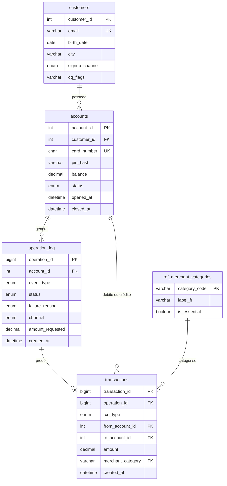

# 2. Dictionnaire de données

Base MySQL `sbs_bank` (jeu de caractères `utf8mb4`). Script de création : `sql/01_schema.sql`.

## Modèle relationnel

**Pourquoi séparer `operation_log` et `transactions` ?** Le journal enregistre **chaque tentative**, réussie ou non : c'est la matière première de l'analyse de la qualité de service. La table `transactions` ne contient que **les mouvements d'argent réels**. Les soldes se recalculent à partir des transactions, ce qui permet de contrôler leur exactitude.

## Organisation en couches

| Couche | Tables | Rôle |
|---|---|---|
| Staging | `stg_customers_raw` | Copie brute de l'export CRM, toutes colonnes en texte, sans transformation |
| Opérationnelle | `customers`, `accounts`, `operation_log`, `transactions` | Données propres et contraintes |
| Référentiel | `ref_merchant_categories`, `ref_analysis_period` | Données de référence et paramètres d'analyse |
| Analytique | `v_account_activity`, `v_monthly_kpis` | Vues portant les définitions métier |

## Tables

### `stg_customers_raw`

Export CRM chargé tel quel. Garder la donnée brute permet de rejouer le nettoyage et de prouver ce qui a été corrigé.

| Colonne | Type | Description |
|---|---|---|
| crm_customer_id | VARCHAR(50) | Identifiant client du CRM (peut apparaître plusieurs fois) |
| first_name, last_name | VARCHAR(100) | Prénom et nom, casse et espaces non normalisés |
| email | VARCHAR(255) | Email brut |
| birth_date | VARCHAR(50) | Date au format `AAAA-MM-JJ` ou `JJ/MM/AAAA`, parfois vide ou aberrante |
| city | VARCHAR(100) | Ville brute (casse, alias) |
| signup_channel | VARCHAR(50) | Canal saisi librement (13 orthographes) |
| updated_at | VARCHAR(50) | Date de dernière mise à jour dans le CRM |
| loaded_at | DATETIME | Date de chargement |

### `customers`

| Colonne | Type | Contraintes | Description |
|---|---|---|---|
| customer_id | INT UNSIGNED | PK | Identifiant client (repris du CRM) |
| first_name, last_name | VARCHAR(100) | NOT NULL | Normalisés (majuscule initiale) |
| email | VARCHAR(255) | UNIQUE, NULL | Minuscules ; NULL si invalide |
| birth_date | DATE | NULL | NULL si absente ou aberrante (avant 1920 ou moins de 18 ans) |
| city | VARCHAR(100) | NULL | Ville normalisée |
| signup_channel | ENUM | NOT NULL | `MOBILE`, `WEB`, `PARTNER` |
| crm_updated_at | DATETIME | NOT NULL | Version retenue (la plus récente) |
| dq_flags | VARCHAR(255) | NULL | Anomalies détectées : `INVALID_EMAIL`, `MISSING_BIRTH_DATE`, `IMPLAUSIBLE_BIRTH_DATE`, `MISSING_CITY` |

### `accounts`

Évolution de la table `card` de la consigne initiale.

| Colonne | Type | Contraintes | Description |
|---|---|---|---|
| account_id | INT UNSIGNED | PK | Identifiant du compte |
| customer_id | INT UNSIGNED | FK vers `customers` | Titulaire |
| card_number | CHAR(16) | UNIQUE, CHECK format `400000` + 10 chiffres | Numéro de carte valide selon Luhn |
| pin_hash | VARCHAR(128) | NOT NULL | Empreinte PBKDF2-SHA256 salée du code PIN (jamais le PIN en clair) |
| balance | DECIMAL(12,2) | CHECK >= 0 | Solde courant |
| status | ENUM | `ACTIVE`, `CLOSED` | Statut du compte |
| opened_at | DATETIME | NOT NULL | Date d'ouverture |
| closed_at | DATETIME | CHECK cohérent avec `status` | Date de clôture |

### `operation_log`

| Colonne | Type | Description |
|---|---|---|
| operation_id | BIGINT UNSIGNED, PK | Identifiant chronologique |
| account_id | INT UNSIGNED, FK, NULL | Compte concerné ; NULL si la carte saisie à la connexion n'existe pas |
| event_type | ENUM | `CREATE_ACCOUNT`, `LOGIN`, `BALANCE_INQUIRY`, `DEPOSIT`, `WITHDRAWAL`, `TRANSFER`, `CARD_PAYMENT`, `CLOSE_ACCOUNT` |
| status | ENUM | `SUCCESS`, `FAILED` |
| failure_reason | ENUM, NULL | `WRONG_PIN`, `UNKNOWN_CARD`, `INVALID_CARD_NUMBER`, `SAME_ACCOUNT`, `ACCOUNT_CLOSED`, `INVALID_AMOUNT`, `INSUFFICIENT_FUNDS` (obligatoire si et seulement si échec) |
| channel | ENUM | `APP` (application), `CARD_NETWORK` (paiement carte), `SEPA` (virement de salaire entrant) |
| amount_requested | DECIMAL(12,2), NULL | Montant demandé, y compris pour une opération refusée |
| created_at | DATETIME | Horodatage |

### `transactions`

| Colonne | Type | Description |
|---|---|---|
| transaction_id | BIGINT UNSIGNED, PK | Identifiant |
| operation_id | BIGINT UNSIGNED, FK, UNIQUE | Opération réussie à l'origine du mouvement |
| txn_type | ENUM | `DEPOSIT`, `WITHDRAWAL`, `TRANSFER`, `CARD_PAYMENT` |
| from_account_id | INT UNSIGNED, FK, NULL | Compte débité (NULL pour un dépôt) |
| to_account_id | INT UNSIGNED, FK, NULL | Compte crédité (NULL pour un retrait ou un paiement) |
| amount | DECIMAL(12,2) | Montant strictement positif |
| merchant_category | VARCHAR(30), FK, NULL | Catégorie du commerçant, obligatoire pour un paiement carte |
| created_at | DATETIME | Horodatage |

Une contrainte `CHECK` impose le sens du mouvement selon le type (un dépôt n'a pas de compte débité, un virement a deux comptes différents, etc.).

### `ref_merchant_categories`

| Colonne | Type | Description |
|---|---|---|
| category_code | VARCHAR(30), PK | Code technique (`GROCERIES`, `TRAVEL`, ...) |
| label_fr | VARCHAR(60) | Libellé affiché |
| is_essential | BOOLEAN | Dépense essentielle ou non |

### `ref_analysis_period`

| Colonne | Type | Description |
|---|---|---|
| period_start, period_end | DATETIME | Période analysée (2025-01-01 au 2026-06-30) |
| dormancy_days | SMALLINT | Seuil de dormance (90 jours) |

## Vues analytiques

### `v_account_activity` (une ligne par compte)

Profil (canal, ville, tranche d'âge, cohorte d'ouverture), activation (`first_deposit_at`, `days_to_first_deposit`), activité (`last_activity_at`, `days_since_last_activity`, nombre de connexions et de paiements), flux financiers (dépôts, virements, dépenses carte, retraits, `balance_at_period_end`) et statut de cycle de vie `lifecycle_status` : `ACTIVE`, `DORMANT`, `NEVER_FUNDED`, `CLOSED`.

### `v_monthly_kpis` (une ligne par mois)

Nouveaux comptes, clôtures, comptes actifs, montants de dépôts, dépenses carte, virements et retraits, taux d'échec dans l'application et taux de refus des paiements carte. Les mois sans activité sont générés par une CTE récursive pour ne jamais disparaître des séries.

## Volumétrie (génération par défaut)

| Table | Lignes |
|---|---:|
| stg_customers_raw | 1 885 |
| customers | 1 800 |
| accounts | 1 881 |
| operation_log | 253 700 environ |
| transactions | 140 800 environ |
