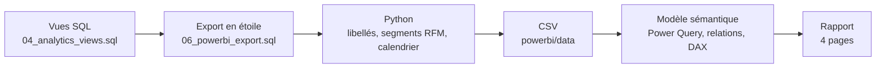
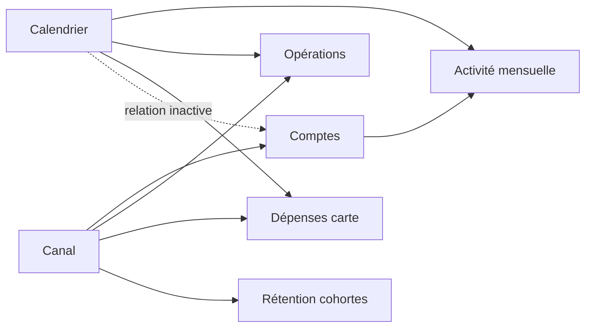

# 5. Tableau de bord Power BI

Le notebook sert à **analyser** et à démontrer une conclusion. Le tableau de bord sert à **piloter** : il permet à un responsable métier de suivre les mêmes indicateurs chaque mois et de filtrer par canal sans écrire de code. En entreprise, c'est généralement le livrable le plus consulté d'un Data Analyst.

## Architecture

| Choix | Pourquoi |
|---|---|
| Agrégation en SQL, à partir des vues analytiques | Power BI affiche exactement les mêmes définitions que le notebook (compte actif, dormant, activation) |
| Segmentation RFM calculée en Python par la fonction partagée `segment_rfm` | Une seule règle, identique dans le notebook et dans Power BI |
| Import de fichiers CSV plutôt qu'une connexion MySQL directe | Le rapport s'ouvre sur n'importe quel poste après un clone du dépôt, sans MySQL ni pilote |
| Format de projet **PBIP** (modèle TMDL, rapport PBIR) plutôt qu'un fichier `.pbix` | Fichiers texte versionnés dans Git : chaque modification du modèle ou d'un visuel est lisible dans l'historique |
| Modèle en étoile | Filtrage simple et performant, mesures DAX courtes et fiables |

## Modèle de données

| Table | Type | Grain | Lignes |
|---|---|---|---:|
| Calendrier | Dimension | Un mois | 18 |
| Canal | Dimension | Un canal d'acquisition | 4 |
| Comptes | Dimension | Un compte (statut, segment RFM, activation, solde) | 1 881 |
| Activité mensuelle | Fait | Un compte par mois d'activité | 12 606 |
| Opérations | Fait | Mois, canal, type d'opération, résultat, motif | 800 |
| Dépenses carte | Fait | Mois, canal, catégorie de commerçant | 477 |
| Rétention cohortes | Fait | Cohorte, canal, mois depuis l'ouverture | 513 |

La relation entre `Calendrier` et `Comptes[Mois ouverture]` est **inactive** : l'activer créerait deux chemins de filtrage vers `Activité mensuelle` (ambiguïté). Elle n'est utilisée que par la mesure `Nouveaux comptes`, via `USERELATIONSHIP`.

Le dossier des fichiers est un paramètre Power Query, `DossierDonnees`. La commande `python -m sbs_bank.pipeline powerbi` le renseigne automatiquement avec le chemin du dépôt sur ton poste.

## Principales mesures DAX

| Mesure | Définition | Point technique |
|---|---|---|
| Taux de comptes actifs | Comptes actifs / comptes | `DIVIDE` pour éviter la division par zéro |
| Comptes actifs dernier mois | Comptes actifs sur le dernier mois du contexte | Variable `VAR` et filtre sur la date maximale |
| Nouveaux comptes | Comptes ouverts dans le mois | `USERELATIONSHIP` sur la relation inactive |
| Taux activation 7 jours | Comptes alimentés sous 7 jours / comptes ouverts depuis 30 jours | Filtres multiples dans `CALCULATE` |
| Taux de rétention | Comptes actifs / taille de la cohorte | Mesure additive, valable par canal ou tous canaux |
| Taux de refus carte | Paiements refusés / tentatives de paiement | Réutilisation de la mesure `Taux d'échec` |
| Interception Luhn | Erreurs bloquées par Luhn / erreurs de numéro de carte | `IN` sur les motifs d'échec |
| Part des encours segmentés | Encours du segment / encours des comptes segmentés | `REMOVEFILTERS` et exclusion des comptes hors segmentation |

Les mesures sont rangées dans la table `Mesures`, par dossier : portefeuille, valeur, activation et rétention, qualité de service.

## Pages du rapport

| Page | Question | Contenu |
|---|---|---|
| Vue d'ensemble | Le portefeuille est-il en bonne santé ? | 5 indicateurs clés, comptes actifs et nouveaux comptes par mois, statuts, taux d'activité par canal |
| Acquisition et rétention | Quel canal amène des clients qui restent ? | Activation par canal, synthèse par canal, matrice de rétention par cohorte avec dégradé de couleur |
| Qualité de service | Où les clients échouent-ils ? | Causes d'échec, évolution du taux de refus carte, efficacité du contrôle de Luhn |
| Valeur et segments | Où se concentrent les encours ? | Dépenses par catégorie, poids des segments RFM en comptes et en encours, profil des segments |

Chaque page porte un filtre **Canal d'acquisition**, synchronisé entre les pages.

Une démonstration animée de la navigation et du filtrage est disponible dans le [README](../README.md#13-tableau-de-bord-power-bi).

## Ouvrir et actualiser le rapport

**Option rapide, sans installation technique :** télécharger [SBS_Bank.pbix](https://github.com/GomuGomuNo01/Simple-Banking-System-Python/releases/latest/download/SBS_Bank.pbix) depuis les [releases](https://github.com/GomuGomuNo01/Simple-Banking-System-Python/releases) et l'ouvrir dans Power BI Desktop 2.157 ou plus récent. Le rapport et les données sont réunis dans ce fichier : aucune actualisation n'est nécessaire. Dans Power BI Desktop, les boutons et les liens s'activent avec **Ctrl + clic**.

**Depuis les sources du dépôt :**

1. Générer les données si ce n'est pas déjà fait : `python -m sbs_bank.pipeline all` (ou `python -m sbs_bank.pipeline powerbi` si la base existe déjà).
2. Ouvrir `powerbi/SBS_Bank.pbip` dans Power BI Desktop.
3. Cliquer sur **Actualiser** (onglet Accueil). Le cache de données n'est pas versionné, les visuels restent vides jusqu'à cette première actualisation.
4. Si le dépôt a été cloné ailleurs sans relancer le pipeline : **Transformer les données**, **Modifier les paramètres**, puis indiquer le chemin du dossier `powerbi/data` (terminé par `\`).

Pour enregistrer une modification faite dans Power BI Desktop, utiliser **Fichier, Enregistrer** : le projet reste au format PBIP et les changements apparaissent dans Git.

## Limites et évolutions possibles

- Le rapport lit un export figé au 30 juin 2026 et non la base en direct. En production, on utiliserait une connexion MySQL avec une passerelle de données et une actualisation planifiée sur le service Power BI.
- Pas de sécurité au niveau des lignes (RLS) : à ajouter si le rapport était partagé avec des équipes n'ayant accès qu'à une partie des clients.
- La liste nominative des comptes à relancer reste dans le CSV du CRM (`reports/liste_prevention_dormance.csv`) : un tableau de bord de pilotage n'a pas vocation à exposer des données individuelles.
